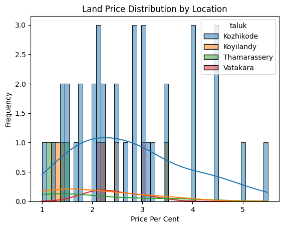
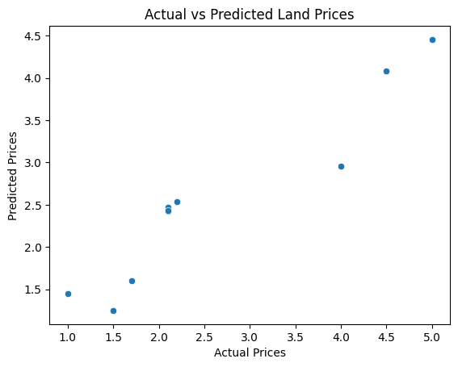
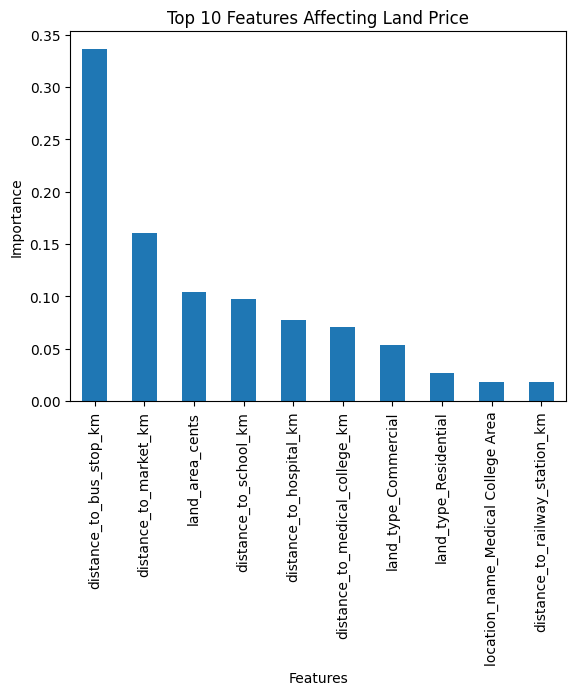

# LAND PRICE PREDICTOR

<b>Predicting Land Prices Based on Location, Land Type and Proximity to Key Facilities</b>

This project aims to predict land prices using machine learning techniques based on factors such as land area, location, land type, and distance to important facilities including schools, hospitals, airports, railway stations, bus stops, and markets. The goal is to analyze real-estate related factors and build a predictive model for estimating land prices accurately.

The repository includes:

<ul>
 <li>data_preprocessing.py - Loads the dataset, calculates price per cent, performs one-hot encoding, feature selection, and train-test split</li>

 <li>train_model.py - Trains the machine learning model using Random Forest Regression</li>

 <li>predict.py - Performs prediction on test data and predicts prices for new land properties</li>

 <li>visualise.py - Generates visualizations including histogram plots, scatter plots, and feature importance analysis</li>

 <li>main.py - Runs the complete ML pipeline including preprocessing, training, prediction, visualization, and model saving</li>
</ul>

## Dataset
- The dataset contains land property details and pricing information
- Features include land area, location details, land type, and distances to nearby facilities
- Target Variable: Price Per Cent
- Dataset Format: CSV

## Features

### Numeric Features
- Land Area (cents)
- Distance to School
- Distance to Airport
- Distance to Railway Station
- Distance to Hospital
- Distance to Medical College
- Distance to Bus Stop
- Distance to Market

### Categorical Features
- Location Name
- Taluk
- Village
- Land Type

## Feature Engineering
- Calculation of Price Per Cent:
  
  Price Per Cent = Price (Lakhs) / Land Area (Cents)

- One-Hot Encoding for categorical variables using pandas get_dummies()

## Machine Learning Model
- Random Forest Regressor using scikit-learn

## Methods
- Data Cleaning and Preprocessing
- Feature Engineering
- One-Hot Encoding
- Train-Test Split
- Regression Modeling
- Prediction Analysis
- Data Visualization

## Exploratory Data Analysis and Visualization
### Histogram Plot for Land Price Distribution

### Scatter Plot for Actual vs Predicted Prices

### Feature Importance Analysis for Model Interpretability

## Results
- Successfully predicted land prices based on location and infrastructure-related factors
- Compared Actual vs Predicted prices for model evaluation
- Identified important features affecting land prices using feature importance analysis

## Installation

- Clone the repository:

https://github.com/ASMAABDULSAMATHE/Land_Price_Predictor-ML.git

- Change Folder: cd Land_Price_Predictor-ML
- Run the project : main.py

<h2>Dependencies</h2>
<ul>
  <li>Python 3.x</li>
  <li>pandas</li>
  <li>scikit-learn</li>
  <li>matplotlib</li>
  <li>seaborn</li>
  <li>joblib</li>
</ul>

<h2>Future Improvements</h2>
<ul>
  <li>Improve model accuracy using hyperparameter tuning</li>
  <li>Add more real-estate related features</li>
  <li>Deploy as a web application using Flask or Streamlit</li>
  <li>Integrate real-time property datasets</li>
  <li>Compare performance with other regression models</li>
</ul>

<h2>Author</h2>

Asma Abdul Samathe - developed as part of Upcode Lab's Bootcamp
